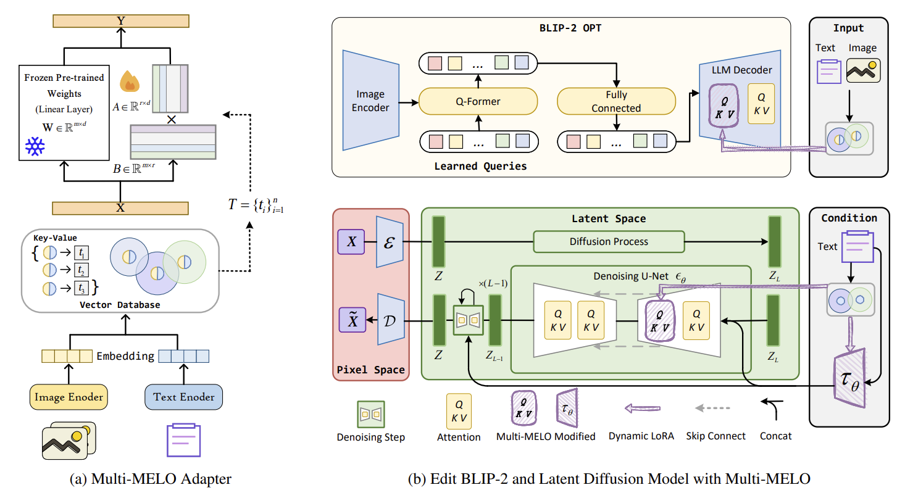
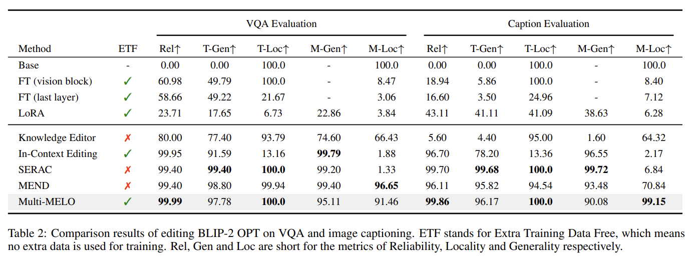
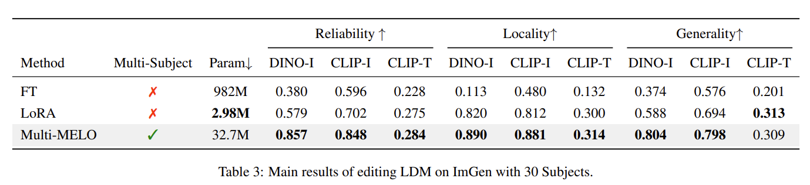

<!-- omit in toc -->
# Multi-MELO: Unified Multimodal Model Editing with Dynamic LoRA
[](https://opensource.org/licenses/MIT)


This repo contains the source code of our proposed Multi-MELO, a unified multimodel model editing method, which supports edting for different network architectures on both the image-to-text and text-to-image tasks. 

<!-- omit in toc -->
## Table of Contents
- [Introduction](#introduction)
- [Experiments](#experiments)
- [Installation](#installation)
- [Datasets](#prepare-datasets)
- [Quick Start](#quick-start)
  - [Editing BLIP-2 on VQA with Multi-MELO](#editing-blip-2-on-vqa-with-multi-melo)
  - [Editing BLIP-2 on Caption with Multi-MELO](#editing-blip-2-on-caption-with-multi-melo)
  - [Editing LDM on ImGen with Multi-MELO](#editing-ldm-on-imgen-with-multi-melo)
- [Acknowledgments](#acknowledgments)

<!-- omit in toc -->
## Updates
- **2023/12/14:** Experiments on editing LDM for personalization during text-to-image generation. :art:
- **2023/10/29:** Experiments on edting BLIP-2 OPT of VQA and Image Captioning :confetti_ball:	
- **2023/09/02:** Pulling the Vector Database out from layer forward pass. :star:


## Introduction
Model editing aims to correct hallucinations or incorporate new knowledge into the pre-trained model. Most previous work focuses on model editing with merely the textual modality, while editing for multimodal models is not well studied. Recent research turns to investigate how to adapt the language model editors into the multimodal scenarios. Whereas, these methods are limited to the image-to-text tasks and similar model architectures. The text-to-image editing task has not been explored, which poses big challenges concerning the significant diversity of complex network architectures. In this paper, we propose a unified multimodal model editing framework based on dynamic LoRA (Multi-MELO), which enables effective editing for various multimodal models by dynamically activating corresponding LoRA blocks that encode the related knowledge. We explore the framework for editing diverse multimodal models (i.e., BLIP-2 and latent diffusion model) on three downstream tasks, including image captioning, visual question answering and text-to-image generation. 


## Experiments
Main results of experiments based on BLIP-2 and Multi-MELO.


## Installation
- `Python=3.7` and `Pytorch=1.13.1` are recommended.
- Required CUDA environment and library dependencies are listed in: 
  ```
  requirements.txt
  ```
  

- Then you should install our modified PEFT:
  <h1 align="center"> <p>🤗 PEFT-Multi-MELO</p></h1>

  ```
  cd peft_egg
  pip install -e .
  ```
  Detailed implementation of MELO is in `./peft_egg/src/perf/melo.py`
## Prepare Datasets
Datasets for both the editing and evaluation are listed as follow:

- Please refer to [EasyEdit](https://github.com/zjunlp/EasyEdit) for the Dataset of Editing and Evaluation on VQA.

- Please refer to [EasyEdit](https://github.com/zjunlp/EasyEdit) for the Dataset of Editing and Evaluation on Caption.

- Please refer to [DreamBooth](https://github.com/google/dreambooth) for the Dataset of Editing and Evaluation on ImGen.
 

## Quick Start
Configurations of our project are governed by [Hydra configs](https://hydra.cc/docs/configure_hydra/intro/). 
Following the hydra format, configurations for editing BLIP-2 and LDM are provided in `./BLIP2_melo/config` and `./DreamBooth_melo/config`

- ### Editing BLIP-2 on VQA with Multi-MELO

  ```
  cd BLIP_melo
  python run_VL.py +alg=lora_blip +experiment=vqa +model=blip2
  ```

- ### Editing BLIP-2 on Caption with Multi-MELO
  ```
  cd DreamBooth_melo
  python run_VL.py +alg=lora_blip +experiment=caption +model=blip2
  ```

- ### Editing LDM on ImGen with Multi-MELO
  ```
  cd DreamBooth_melo
  python ft_run.py +algs=ft_diff +experiment=diffusion +model=dreambooth
  python lora_run.py +algs=lora_diff +experiment=diffusion +model=dreambooth
  python melo_run.py +algs=melo_diff +experiment=diffusion +model=dreambooth
  ```


## Acknowledgments
We would like to thank the following individuals and organizations for their contributions to this project:
```
Huggingface: for their support of the PEFT community and their development of the PEFT framework (https://github.com/huggingface/peft)
MELO: for the development of the open-source library MELO which inspired our work (https://github.com/ECNU-ICALK/MELO)
EasyEdit: for the development of the open-source Dataset (https://github.com/zjunlp/EasyEdit)
DreamBooth: for the development of the open-source Dataset (https://github.com/google/dreambooth)
```
