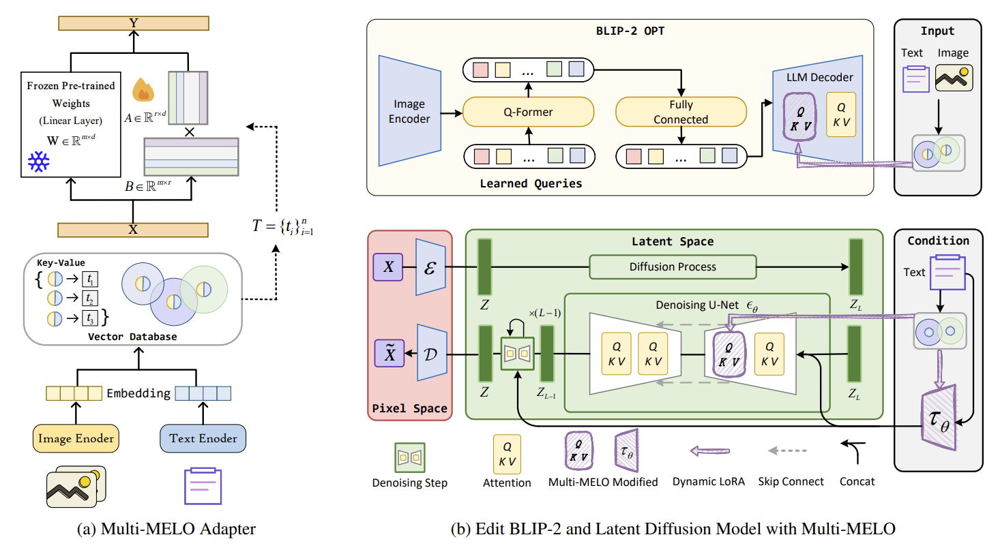
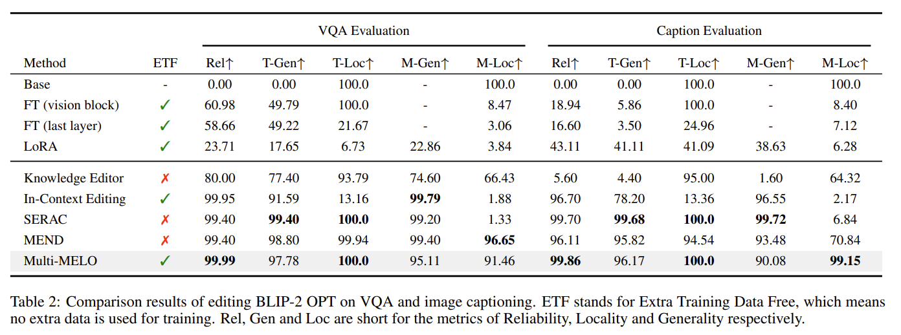
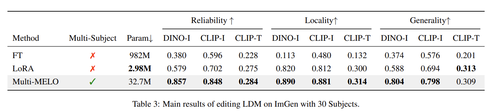

<!-- omit in toc -->
# Multi-MELO: Unified Multimodal Model Editing with Dynamic LoRA
This repo contains the source code of our proposed Multi-MELO, a unified multimodel model editing method, which supports edting for different network architectures on both the image-to-text and text-to-image tasks. 

<!-- omit in toc -->
## Updates
- **2023/12/14:** Experiments on editing LDM for personalization during text-to-image generation. :art:
- **2023/10/29:** Experiments on edting BLIP-2 OPT of VQA and Image Captioning :confetti_ball:	
- **2023/09/02:** Pulling the Vector Database out from layer forward pass. :star:

<!-- omit in toc -->
## Table of Contents
- [Introduction](#introduction)
- [Experiments](#experiments)
- [Prepare Environments](#prepare-environments)
- [Prepare Datasets](#prepare-datasets)
- [Quick Start](#quick-start)
  - [Editing GPT2-XL on Hallucination with MELO](#editing-gpt2-xl-on-hallucination-with-melo)
  - [Editing BERT on SCOTUS with MELO](#editing-bert-on-scotus-with-melo)
  - [Editing T5 on zsRE with MELO](#editing-t5-on-zsre-with-melo)
- [Acknowledgments](#acknowledgments)
## Introduction
Model editing aims to correct hallucinations or incorporate new knowledge into the pre-trained model. Most previous work focuses on model editing with merely the textual modality, while editing for multimodal models is not well studied. Recent research turns to investigate how to adapt the language model editors into the multimodal scenarios. Whereas, these methods are limited to the image-to-text tasks and similar model architectures. The text-to-image editing task has not been explored, which poses big challenges concerning the significant diversity of complex network architectures. In this paper, we propose a unified multimodal model editing framework based on dynamic LoRA (Multi-MELO), which enables effective editing for various multimodal models by dynamically activating corresponding LoRA blocks that encode the related knowledge. We explore the framework for editing diverse multimodal models (i.e., BLIP-2 and latent diffusion model) on three downstream tasks, including image captioning, visual question answering and text-to-image generation. 


## Experiments
Main results of experiments based on BLIP-2 and Multi-MELO.


## Prepare Environments
Required CUDA environment and library dependencies are listed in: 
```
requirements.txt
```
Then you should install our modified PEFT:
<h1 align="center"> <p>🤗 PEFT-Multi-MELO</p></h1>

```
cd peft_egg
pip install -e .
```
Detailed implementation of MELO is in `./peft_egg/src/tuners/melo.py`
## Prepare Datasets
The zsRE experiments use data linked by the [MEND](https://github.com/eric-mitchell/mend) repository. Download the data for NQ and zsRE from their Google Drive link and unzip each sub-directory into ./melo/data. SCOTUS and Hallucination data are loaded through huggingface.

## Quick Start
The location of inner vector database and dynamic LoRA target modules can be modified in `./melo/model/config`

### Editing GPT2-XL on Hallucination with MELO
```
cd melo
python run.py +alg=lora +experiment=hallucination +model=gpt2xl
```

### Editing BERT on SCOTUS with MELO
```
cd melo
python run.py +alg=lora +experiment=scotus +model=scotus-bert
```

### Editing T5 on zsRE with MELO
```
cd melo
python run.py +alg=lora +experiment=qa +model=t5small
```


## Acknowledgments
We would like to thank the following individuals and organizations for their contributions to this project:
```
Huggingface: for their support of the PEFT community and their development of the PEFT framework (https://github.com/huggingface/peft)

GRACE: for the development of the open-source library GRACE which inspired our work (https://github.com/Thartvigsen/GRACE)
```
